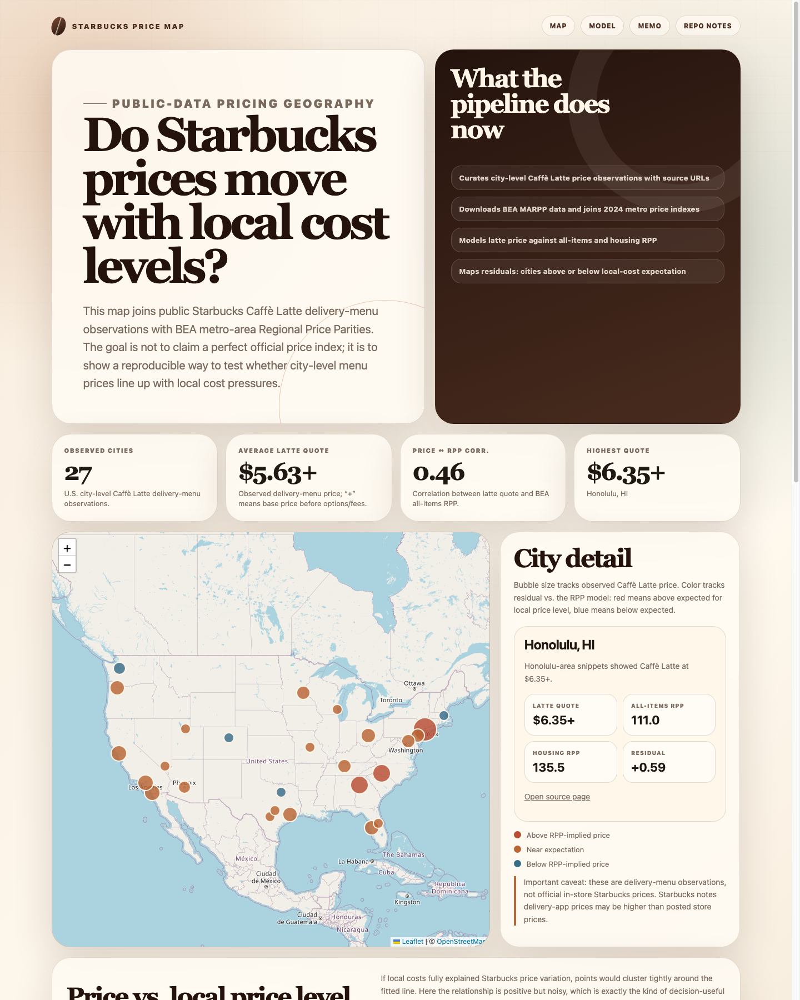
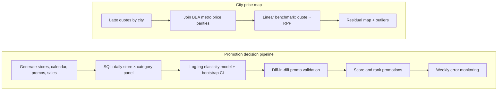
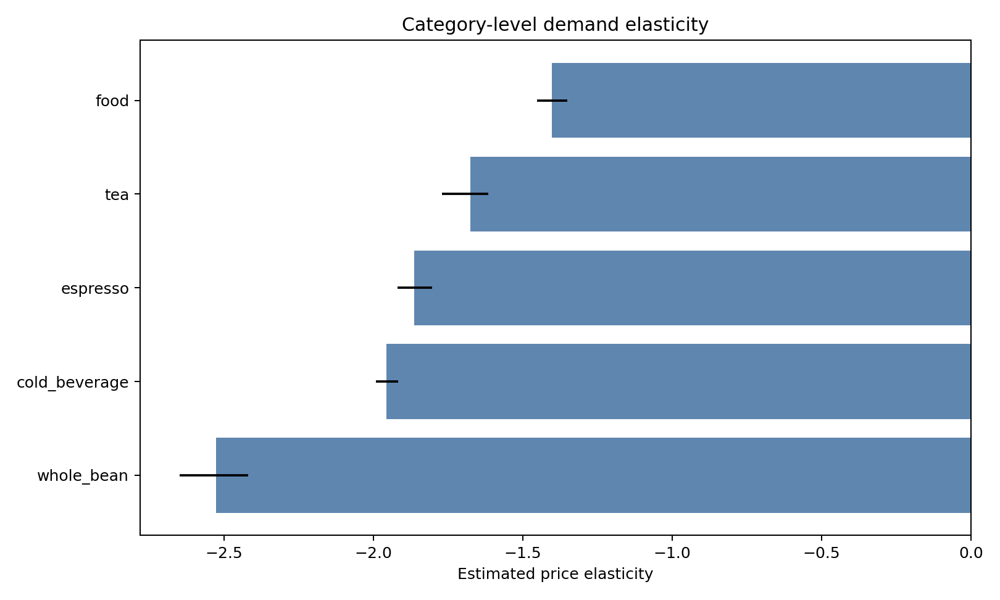
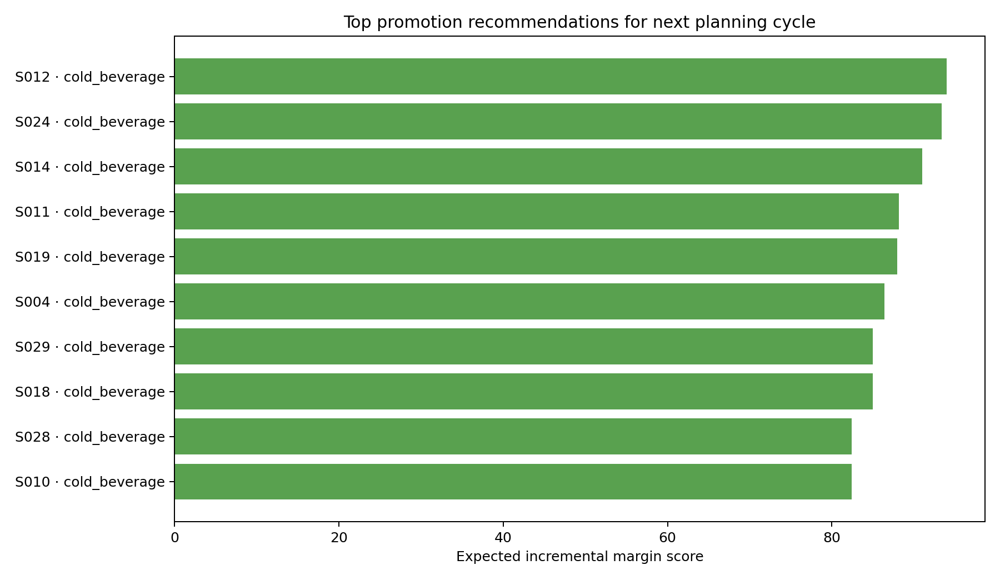
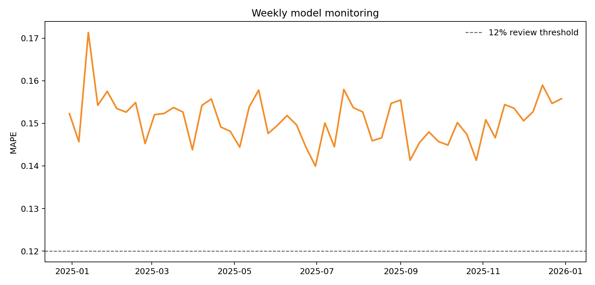

# Coffee Retail Decision Science

**Do coffee menu prices track local cost of living, and how should a retailer pick next week's promotions?**

A compact, end-to-end decision science project built on public and synthetic data. It goes from a business question to a modeling table, an elasticity model, a causal check, a ranked recommendation, and a monitoring view. Everything is reproducible with three commands.



## What it answers

| Layer | Question | Data | Output |
| --- | --- | --- | --- |
| City price map | Do Starbucks latte prices vary by U.S. city in line with local price levels? | Public delivery-menu quotes + BEA Regional Price Parities | Interactive map, residual scatter, outlier table |
| Promotion pipeline | Which store × category promotions are worth running next week? | Synthetic store, calendar, promo, and sales panel | Elasticity by category, promo lift validation, ranked recommendations, weekly monitoring |

The map uses real public observations. The promotion pipeline uses synthetic data so that the full workflow can be shared without proprietary tables.

## Pipeline



## Key results

Numbers below come from the committed synthetic run and are meant to show the workflow, not real retail performance.

- **Price sensitivity differs by category.** Whole bean is the most elastic category; food is the least. Discounts on food are less likely to pay back through volume alone.
- **Promotion lift is validated, not assumed.** A difference-in-differences check on a cold-beverage promotion wave estimates incremental units above both the store's own baseline and a concurrent control group.
- **Recommendations trade volume against margin.** Candidates are scored as expected incremental units × margin per unit − discount cost, so the top pick is not simply the deepest discount.
- **The model is monitored.** A weekly MAPE table flags weeks above a review threshold before outputs are used for decisions.

| Elasticity by category | Top promotion candidates | Model monitoring |
| --- | --- | --- |
|  |  |  |

Read the short [executive summary](outputs/executive_summary.md) and the [city price map memo](outputs/city_price_map_memo.md) for the written recommendations and caveats.

## Methodology

**City price map.** Manually curated Caffè Latte delivery-menu quotes across selected U.S. cities are joined to BEA 2024 metro-area Regional Price Parities. A linear benchmark predicts the quote from the all-items RPP, and the residual (observed − implied) is the diagnostic. Positive residuals flag cities priced above what local cost alone would predict.

**SQL feature layer.** The modeling table is built in SQL at the daily store × category grain: demand, revenue, margin, price and discount features, holiday/weekend/weather/seasonality controls, and rolling trailing baselines. See [`sql/create_model_features.sql`](sql/create_model_features.sql).

**Demand model.** `log(units) ~ log(price) + promo_depth + weather + holiday + weekend + store_type + category`. The `log(price)` coefficient is the elasticity. Category-level estimates come from fitting the same controlled model per category, with bootstrap uncertainty bands.

**Causal validation.** `(treated after − treated before) − (control after − control before)` on promoted store-category pairs.

**Decision scoring.** `expected incremental units × expected margin per unit − discount cost`.

**Monitoring.** [`sql/monitoring_checks.sql`](sql/monitoring_checks.sql) produces weekly prediction error and bias with review thresholds.

## Caveats

- Starbucks observations are delivery-app quotes, which Starbucks states may be higher than in-store prices. A production version would collect multiple stores per city through a governed process and separate delivery markup from menu pricing.
- The promotion pipeline is synthetic. Elasticities, lifts, and recommendations describe the generator, not any real business.

## Run it

```bash
python3 -m venv .venv && source .venv/bin/activate
pip install -r requirements.txt
python -m src.coffee_decision_science.generate_synthetic_data
python -m src.coffee_decision_science.pipeline
python -m src.coffee_decision_science.city_price_map
```

Then preview the dashboard:

```bash
python3 -m http.server 4173
```

Open `http://localhost:4173`.

## Repository layout

```text
data/                          synthetic data, curated city observations, local SQLite
sql/                           feature layer and monitoring checks
src/coffee_decision_science/   data generation, pipeline, city price map
outputs/                       charts, CSVs, memos, and map payload
index.html                     static dashboard (Vercel / GitHub Pages ready)
```

## What I would productionize next

- Replace synthetic tables with governed internal data and move the SQL layer into dbt.
- Schedule with Airflow or Databricks and add data-quality checks.
- Use Bayesian hierarchical elasticity to borrow strength across sparse store-category cells.
- Track drift in elasticity, forecast error, promo mix, and recommendation adoption in a BI dashboard.
